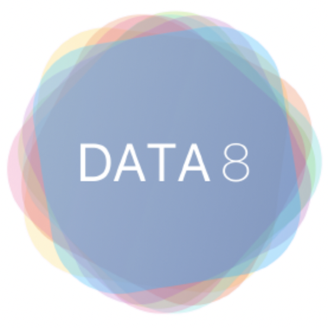
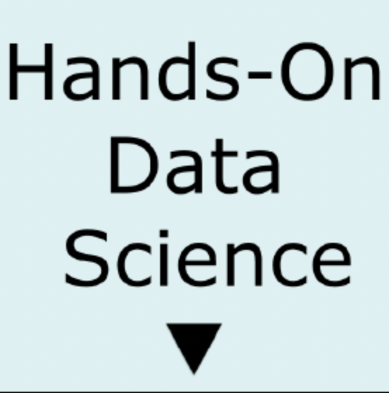

### Data Science

<table style="width:100%;border:0px;border-spacing:0px;border-collapse:separate;margin-right:auto;margin-left:auto;">

<tr>
    <td style="padding:2.5%;width:25%;vertical-align:middle;min-width:120px">
    
    </td>
    <td style="padding:2.5%;width:75%;vertical-align:middle">
    <h3>Principles of Data Science</h3>
     
    Advised by Suraj Rampure, Janine Tiefenbruck, Rod Albuyeh
     
    <em>DSC 10 FA23</em>
     

    <a href="../assets/pdfs/dsc10fa23eval.pdf">evaluation</a> / <a href="https://dsc-courses.github.io/dsc10-2023-fa/">website</a>
    
    

    
Based off UC Berkeley's Data 8, this course is a broad introduction to data exploration, statistical inference, and prediction. Students learn these concepts through Python, as well as the foundational ways to think like a data scientist. As a result, students become data literate, and become proficient in reading in datasets and performing operations on them for inference and discovery, mimicing the practices of real industry data scientists.

    </td>
</table>

### Cognitive Science

<table style="width:100%;border:0px;border-spacing:0px;border-collapse:separate;margin-right:auto;margin-left:auto;">

  <tr>
    <td style="padding:2.5%;width:25%;vertical-align:middle;min-width:120px">
      
    </td>
    <td style="padding:2.5%;width:75%;vertical-align:middle">
      <h3>Data Science in Practice</h3>
       
      Advised by Prof. Shannon Ellis
       
      <em>UCSD COGS 108 WI24</em>
       
      
      <a href="../assets/pdfs/cogs108wi23eval.pdf">evaluation</a> / <a href="https://github.com/COGS108/">organization</a>
      
      

      
COGS 108 - Data Science in Practice - is a class offered by the Cognitive Science Department of UC San Diego, taught by Professors Bradley Voytek, Shannon Ellis, & Jason Fleischer. Here is an overview and map of the COGS 108 Organization, which hosts materials and assignments for the class. It teaches concepts taught in UCSD's DSC 80 and UC Berkeley's Data 8 & Data 100

    </td>
  </tr>
 
</table>

