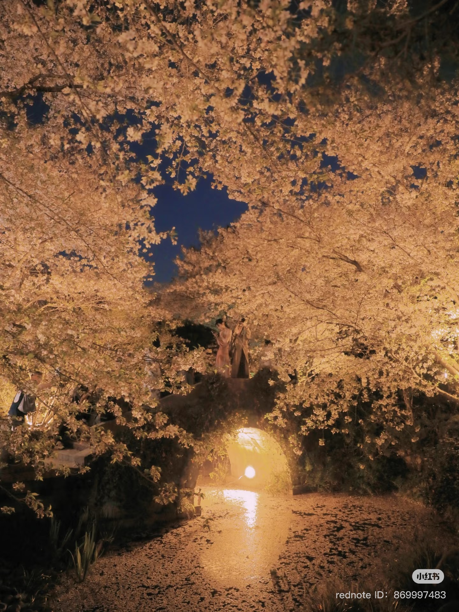
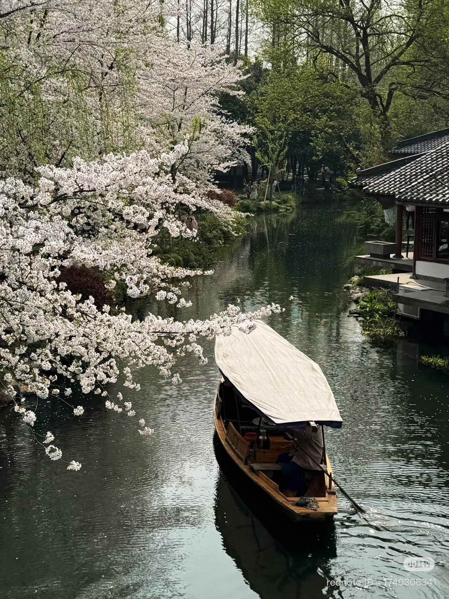
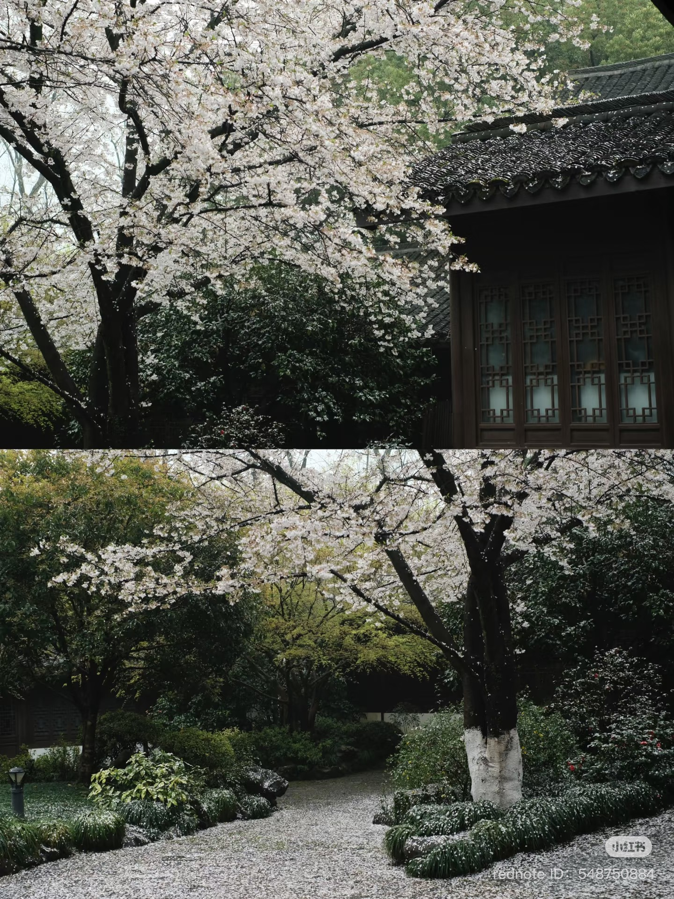
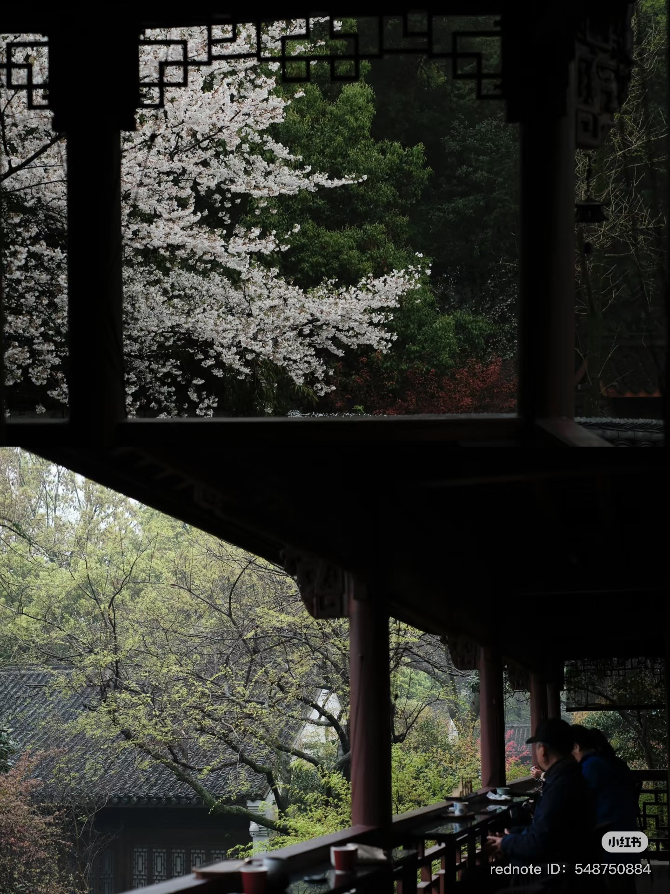
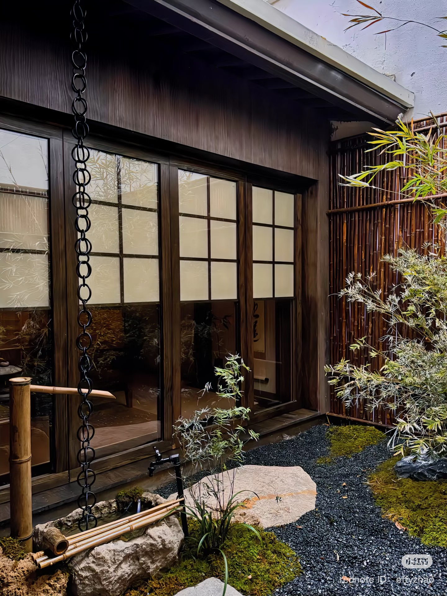

# Ranking 

1. Kyoto
2. Shanghai
3. Zhujiajiao
4. Lucerne
5. Tokyo
6. New York
7. Paris
8. Nice
9. Los Angeles
10. San Francisco
11. Manila
12. Barcelona
13. San Diego

# Recommendations

## Tokyo

## Kyoto

## Shanghai

## Hangzhou

### Historic & Nature
- 中国院子梦溪苑 (Mengxi Yuan)
  
  
  

- 曲院风荷 (Quyuan Fenghe)
  

- 云松书舍 (Yunsong Shushe)
  

- Manou Temple
  
  
- 太子湾 (Taiziwan)
- Hu Xueyan Mansion

### Food
- Sakura Coffee and Tea House at Manou
- (白玉京茶) Baiyujing Teahouse
- 廿一茶仓 (hidden in Xiaohe)
  
  
  
  
  

### Shopping
小河 (Xiaohe Historic Block)
河坊街 (Hefangjie Block)
南山路 (Nanshan Road)

## New York
