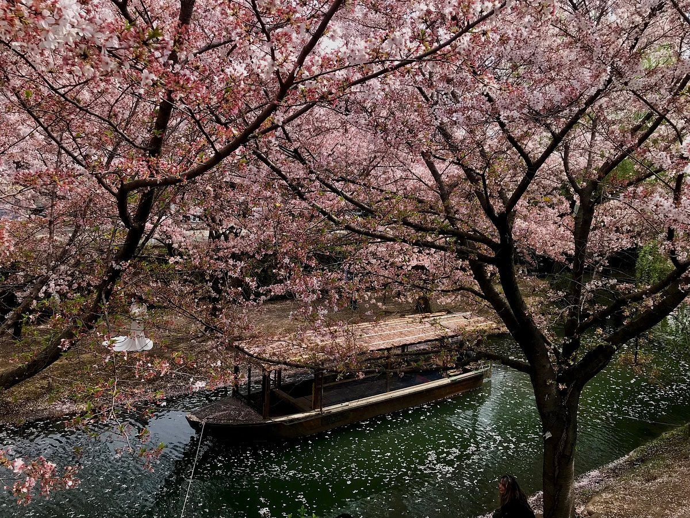
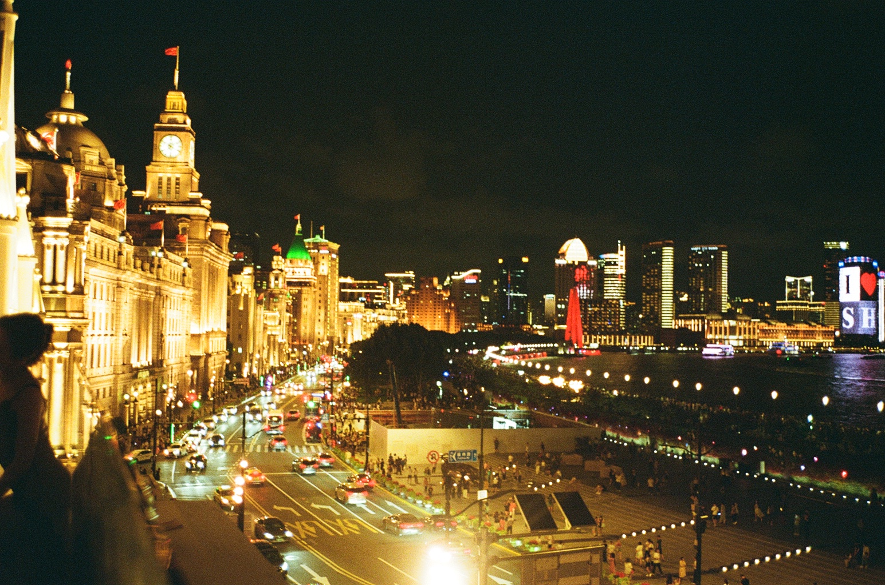

# Ranking 

1. Kyoto
2. Shanghai
3. Zhujiajiao
4. Lucerne
5. Tokyo
6. New York
7. Paris
8. Nice
9. Los Angeles
10. San Francisco
11. Manila
12. Barcelona
13. San Diego

# Recommendations

## Tokyo

### Historic & Nature
- Kyu Asakura House
- Inokashira Park
- Nakameguro

### Food
- Nadoya No Katte

### Shopping
- Context Tokyo
- The Archive Store
- Coverchord
- 1LDK
- Sinot
- Kapital Legs

## Kyoto

### Historic & Nature
- Fushiki Jikkoku-bune
  

- Arashiyama
- Sanzen-in
- Jikko-in
- Rurikō-in 
- Tenjuan

### Food
- Okutan Kiyomizu 総本家ゆどうふ 奥丹 清水 (nice dining views)
- Yuyuza Ryokan
- Rokujan
- Kazariya (open dining concept)
- Weekender’s Coffee
- Le Labo Kyoto

### Shopping
- Otsu Kei
- Taiga Takahashi
- Kapital

## Shanghai

### Historic & Nature
- The Bund (Casanova)
  

- Zhujiajiao
  

- French Concession
- 豫园 (Yu Garden)

### Food
- Chagee
- Heytea
- 宫宴 (Gongyan)
- 鲁迅公园 (Luxun Park - cherry blossom pond)
- 巨鹿路 (Julu Road)
- 长乐路 (Changle Road)
- 南京路 (Nanjing Road)

### Shopping
- 新天地 (Xintiandi)
- The Orient Goods
- 安福路 (Anfu Road)
- 武康路 (Wukang Road)

## Hangzhou

### Historic & Nature
- 中国院子梦溪苑 (Mengxi Yuan)
  
  
  

- 曲院风荷 (Quyuan Fenghe)
  

- 云松书舍 (Yunsong Shushe)
  

- Manou Temple
  
  
- 太子湾 (Taiziwan)
- Hu Xueyan Mansion

### Food
- Green Tea Restaurant Longjing
- Luxiaozhang Chongqing Hotpot
- Sakura Coffee and Tea House at Manou
- (白玉京茶) Baiyujing Teahouse
- 廿一茶仓 (hidden in Xiaohe)
  
  
  
  
  

### Shopping
- 小河 (Xiaohe Historic Block)
- 河坊街 (Hefangjie Block)
- 南山路 (Nanshan Road)

## New York

### Historic & Nature
- Noguchi Museum
- Brooklyn Botanical Garden
- Dumbo

### Food
- Floating Mountain
- Puerh Brooklyn
- Mono+Mono
- Win Son
- Konban
- Izakaya Mew
- nonono
- Sorate
- Kijitora East

### Shopping
- Komune
- 180 the Store
- Ven Space
- IF Soho
